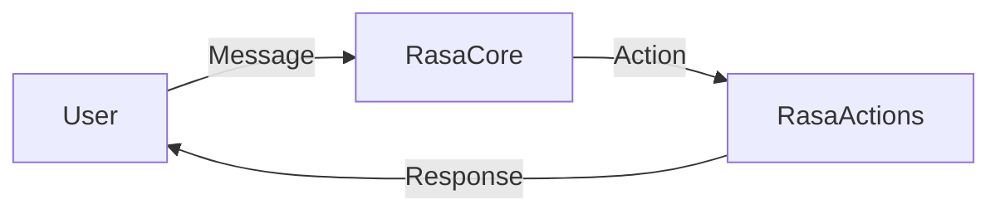
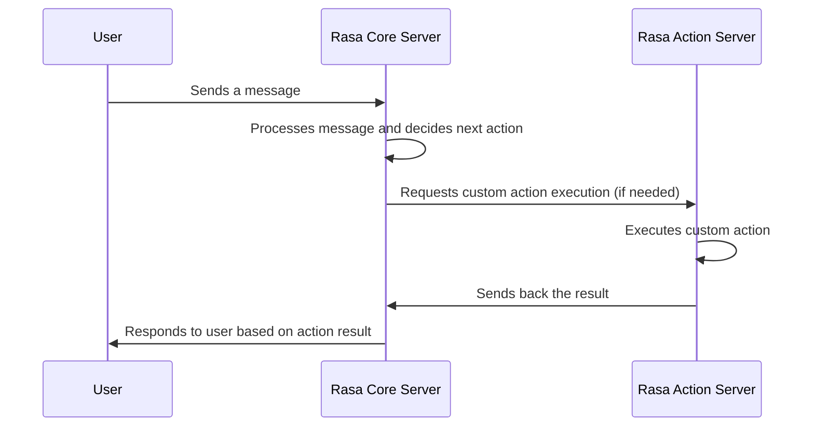

# Rasa Info

## Basic run

```bash
cd ./rasabot # folder rasa was installed

python -m rasa run --enable-api --cors "*"

python -m rasa shell --debug

```

## Run with actions: 

```bash

cd ./rasabot # folder rasa was installed

rasa run actions
```
Actions will run on a seperate process/server:



This is the flow chart




## Remove models 

P.S we may need to version the dataset

(rasa cli)[https://rasa.com/docs/rasa/command-line-interface]

rasa visualize to see the chatflow


